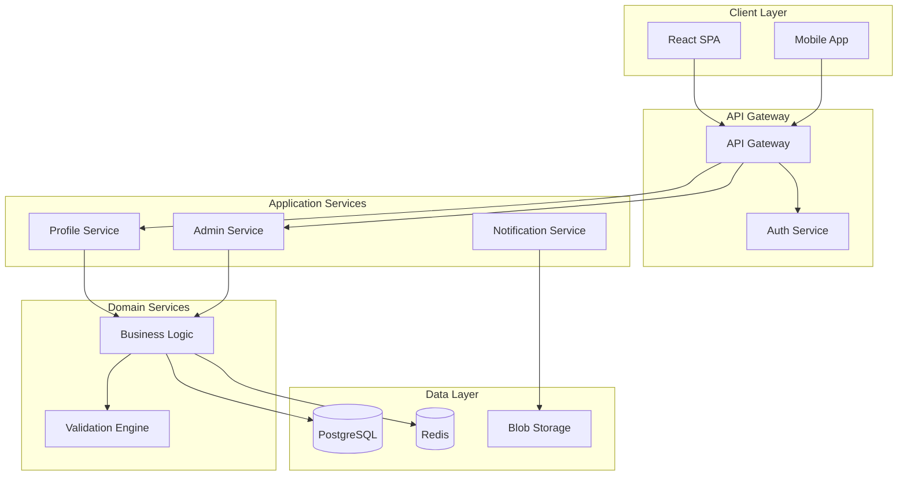

## PRIMARY DIRECTIVE

Generate a **repository overview and architecture document** for the repository. The document must be:
- **Compliant** with all template format, structure, and guidelines
- **Machine-readable** and structured for autonomous execution by AI systems or human teams
- **Deterministic**, with no ambiguity or placeholder content

Creating a comprehensive and well-structured repository overview and architecture document is a foundational step in ensuring all downstream planning, design, and implementation activities are aligned with the project's goals and technical requirements. You MUST thoroughly follow the provided template and instructions to ensure completeness and clarity.

## WORKFLOW STEPS

Present the following steps as **trackable todos** to guide progress:

1. **Deep Research**
   - Use the #runSubagent tool to invoke a sub-agent that will:
     - Use the `code-search/*` tools to examine the overall repository structure — key directories, modules, and components
     - Analyze dependency files (package.json, requirements.txt, .csproj, etc.) to extract exact versions and purposes
     - Identify the high-level solution architecture, component interactions, and data flow
     - Perform deep analysis of the technical stack — languages, frameworks, libraries, design patterns, and infrastructure services
     - Identify and describe the key modules, their purpose, main functionalities, and how they fit into the overall architecture
     - Respond with a structured summary of repository structure, technical stack, architecture, and key modules

2. **Application Components, Data Architecture & API Specifications**
   - Use the #runSubagent tool to invoke three parallel sub-agents:
     - **Application Components sub-agent**: Use the `code-search/*` tools to identify and describe the major business and system components within the application — their namespaces, key classes/interfaces, and how they interact to fulfill requirements
     - **Data Architecture sub-agent**: Use the `code-search/*` tools to analyze data architecture — storage mechanisms, data models, access patterns, relationships, and any data flow diagrams
     - **API Specifications sub-agent**: Use the `code-search/*` tools to document API specifications if the repository exposes any APIs — endpoints, request/response formats, authentication mechanisms, and integration points with other systems

3. **Draft the Document**
   - Synthesize findings from all sub-agents into a complete repository overview document
   - Follow the mandatory template format with all required sections
   - Include mermaid diagrams where appropriate to illustrate architecture
   - Ensure all content is based on actual codebase analysis, not placeholders

4. **Review and Refine**
   - Use the #runSubagent tool to invoke a sub-agent that will:
     - Critically review the drafted document for completeness, accuracy, and clarity
     - Use the `code-search/*` tools to verify key claims against the actual codebase
     - Validate that no major modules, components, or patterns were missed
     - Check for gaps in logic or missing information
     - Make necessary adjustments based on self-review

## FILE NAMING CONVENTION

- File Location: `${config.project.overview_path}`, which defaults to `./docs/repository_overview.md`

## MANDATORY TEMPLATE

```markdown
---
repository: [Repository Name]
version: [e.g., 1.0.0]
date_created: [YYYY-MM-DD]
last_updated: [YYYY-MM-DD]
owner: [Team/Individual responsible]
type: [e.g., Microservice, Monolith, Library, Full-Stack Application]
---

# Repository Overview

[Brief description of the repository's purpose, the problem it solves, and its role in the larger ecosystem.]

## 1. Technical Stack

**Summary**: [High-level overview of the technology choices and rationale]

### Core Technologies

[Example]

| Category | Technology | Version | Purpose |
|----------|------------|---------|---------|
| **Runtime** | .NET | 8.0 | Backend services and APIs |
| **Language** | TypeScript | 5.x | Frontend application logic |
| **Framework** | React | 18.x | User interface components |
| **Database** | PostgreSQL | 15.x | Primary data storage |
| **Cache** | Redis | 7.x | Session and data caching |
| **Container** | Docker | 24.x | Application containerization |

### Infrastructure Services

[Example]

| Service | Provider | Purpose | Configuration |
|---------|----------|---------|---------------|
| **Compute** | Azure App Service | Web application hosting | B2 tier, 2 instances |
| **Storage** | Azure Blob Storage | File and media storage | Hot tier, GRS |
| **Messaging** | Azure Service Bus | Async communication | Standard tier |
| **Monitoring** | Application Insights | APM and logging | Full telemetry |

## 2. Solution Architecture

**Summary**: [Describe the architectural pattern and key design decisions]

### System Components

[Example]



### Architectural Patterns

[Example]

| Pattern | Implementation | Rationale |
|---------|---------------|-----------|
| **Domain-Driven Design** | Bounded contexts for each business domain | Clear separation of concerns |
| **CQRS** | Separate read/write models | Optimized query performance |
| **Event Sourcing** | Event store for audit trail | Complete system history |
| **Repository Pattern** | Data access abstraction | Testability and flexibility |

## 3. Project Structure

**Summary**: [Overview of the repository organization and module structure]

### Directory Layout

[Example]

```
/
├── src/
│   ├── Web/                 # Frontend React application
│   ├── API/                 # REST API endpoints
│   ├── Application/         # Application layer services
│   ├── Domain/              # Core business logic
│   ├── Infrastructure/      # External service integrations
│   └── Shared/              # Cross-cutting concerns
├── tests/
│   ├── Unit/                # Unit test projects
│   ├── Integration/         # Integration test projects
│   └── E2E/                 # End-to-end test suites
├── docs/                    # Technical documentation
├── scripts/                 # Build and deployment scripts
└── .github/                 # CI/CD workflows
```

### Key Modules

[Example]

| Module | Path | Responsibility | Dependencies |
|--------|------|----------------|--------------|
| **Web.Client** | `/src/Web/` | User interface and client routing | React, Redux, Axios |
| **API.Gateway** | `/src/API/` | HTTP endpoints and request handling | ASP.NET Core, MediatR |
| **Application.Services** | `/src/Application/` | Use case orchestration | Domain, FluentValidation |
| **Domain.Core** | `/src/Domain/` | Business entities and rules | None (pure domain) |
| **Infrastructure.Data** | `/src/Infrastructure/` | Database and external services | EF Core, Azure SDK |

## 4. Application Components

**Summary**: [Description of the major functional components within the application]

### Business Components

[Example]

| Component | Namespace | Description | Key Classes |
|-----------|-----------|-------------|-------------|
| **Authentication** | `App.Auth` | User identity and access control | `AuthService`, `TokenProvider`, `PermissionManager` |
| **Profile Management** | `App.Profile` | User profile and preferences | `ProfileService`, `UserRepository`, `ProfileValidator` |
| **Administration** | `App.Admin` | System configuration and management | `AdminService`, `ConfigManager`, `AuditLogger` |
| **Reporting** | `App.Reports` | Analytics and data visualization | `ReportEngine`, `DataAggregator`, `ExportService` |
| **Notifications** | `App.Notifications` | Multi-channel messaging | `NotificationHub`, `EmailSender`, `PushService` |

### System Components

[Example]

| Component | Namespace | Description | Interfaces |
|-----------|-----------|-------------|------------|
| **Domain Layer** | `Domain` | Core business logic and entities | `IEntity`, `IAggregateRoot`, `IRepository` |
| **Application Layer** | `Application` | Application services and DTOs | `IApplicationService`, `IValidator`, `IMapper` |
| **Infrastructure Layer** | `Infrastructure` | External service implementations | `IDbContext`, `IMessageBus`, `IFileStorage` |
| **Cross-Cutting** | `Shared` | Shared utilities and helpers | `ILogger`, `ICacheService`, `IDateTimeProvider` |

## 5. Data Architecture

**Summary**: [Overview of data storage, models, and access patterns]

### Data Models

[Example]

| Entity | Table/Collection | Description | Relationships |
|--------|-----------------|-------------|---------------|
| **User** | `users` | System user accounts | Has many Profiles, Roles |
| **Profile** | `profiles` | User profile information | Belongs to User |
| **Role** | `roles` | Authorization roles | Many to many with Users |
| **AuditLog** | `audit_logs` | System activity tracking | Polymorphic associations |
| **Configuration** | `configurations` | System settings | Standalone |

### Data Access Patterns

[Example]

| Pattern | Implementation | Use Case |
|---------|---------------|----------|
| **Repository** | Generic repository with specifications | Standard CRUD operations |
| **Unit of Work** | Transaction management per request | Consistency across operations |
| **Query Objects** | Encapsulated complex queries | Reporting and analytics |
| **Caching Strategy** | Redis with cache-aside pattern | High-frequency reads |

## 6. API Specifications

**Summary**: [Overview of API design and endpoints]

### API Endpoints

[Example]

| Endpoint | Method | Purpose | Authentication |
|----------|--------|---------|----------------|
| `/api/auth/login` | POST | User authentication | None |
| `/api/users/{id}` | GET | Retrieve user details | Bearer token |
| `/api/profiles` | GET/POST/PUT | Profile management | Bearer token |
| `/api/admin/*` | ALL | Administrative operations | Admin role |
| `/api/reports/{type}` | GET | Generate reports | Bearer token |

### Integration Points

[Example]

| System | Protocol | Direction | Purpose |
|--------|----------|-----------|---------|
| **Payment Gateway** | REST/HTTPS | Outbound | Payment processing |
| **Email Service** | SMTP/API | Outbound | Email notifications |
| **Identity Provider** | OAuth2/OIDC | Bidirectional | SSO authentication |
| **Analytics Platform** | Event streaming | Outbound | Usage analytics |

---

*Last Updated: [Date]*

```
