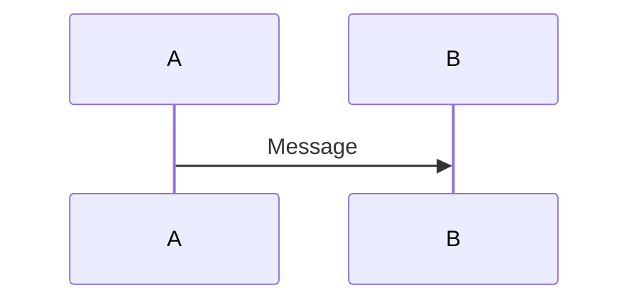

# Documentation Template

---
## 📐 FORMATTING RULES
---

### Mermaid Diagram Syntax

**Azure DevOps Wiki syntax (default):**
```
::: mermaid
sequenceDiagram
    participant A
    A->>B: Message
:::
```

**GitHub syntax (if configured):**
```

```

### Code in Documentation

| Include ✅                   | Avoid ❌                        |
| --------------------------- | ------------------------------ |
| Pseudo-code algorithms      | Actual implementation code     |
| Configuration JSON examples | Internal class implementations |
| Public API signatures       | Private method details         |
| Integration patterns        | Step-by-step code walkthroughs |
| **Public SDK types**        | **Internal schema types**      |

**Rationale:** Code snippets become stale. Pseudo-code captures logic without coupling to implementation.

**⚠️ Use Customer-Facing Types in Examples:**
- Always reference **public SDK/API types** that consumers actually use
- Avoid **internal schema/implementation types** even if they're what the service uses internally
- Example: If public API accepts `string` for locale but internal code uses `CultureInfo?`, documentation should show `string`
- **Why:** Documentation teaches consumers how to use the API, not how the service implements it internally

---

### File Path References - When to Link vs Name

| Link to file path ✅                               | Just name the class ❌   |
| ------------------------------------------------- | ----------------------- |
| Entry points (Startup.cs, main Worker, main Job)  | Implementation details  |
| Configuration files (appsettings, config.json)    | Internal helper classes |
| Extension points (interfaces consumers implement) | Private/internal types  |

**Why:** Implementation files get refactored and relocated frequently. Entry points and configuration files are stable anchors.

**⚠️ Verification Required:** Before adding a file link, **verify the path exists**. Don't assume conventional folder structures (`Image/`, `Ocr/`, `Jobs/`) - implementations vary.

**Pattern:** Use an "Entry Points" section with 2-3 verified links instead of scattering paths throughout the document:
```markdown
### Entry Points
- **Service registration:** [Startup.cs](../../src/Service.X/Startup.cs)
- **Job execution:** [XJob.cs](../../src/Service.X/Worker/Jobs/XJob.cs)
```

---

### Section Organization

**Required sections (in order):**
1. Overview (What/Why/When)
2. Core Architecture (Flow + Key Components + Design Decisions)
3. API Reference (Interfaces + Config + Dependencies + Examples)
4. Common Scenarios (How-to guides + Troubleshooting)
5. Key Insights (Performance + Gotchas + Production learnings)
6. Testing (Coverage summary)
7. Related Documentation (Links)

**Optional sections:**
- Algorithm Deep Dive (for complex algorithms)
- Change History (for significant refactors)

---
---
---

# 📄 TEMPLATE STARTS HERE

---
---
---

# [Name]

## Overview

- **What:** [Brief description of purpose and responsibilities]
- **Why:** [Problem this solves]
- **When:** [Usage scenarios - when should developers use this?]

---

## Core Architecture

### Flow

**Option 1: Sequence Diagram (for multi-service flows)**

::: mermaid
sequenceDiagram
    participant Client
    participant Service
    participant Database
    
    Client->>Service: Request
    Service->>Database: Query
    Database-->>Service: Results
    Service-->>Client: Response
:::

**Option 2: Simple Text Flow (for linear pipelines)**

```
[Entry Point] → [Stage 1] → [Stage 2] → [Output/Result]
```

**Flow Details:**
1. **[Stage Name]** - [What happens, key operations]
2. **[Stage Name]** - [What happens, dependencies on previous stages]
3. **[Output]** - [Final result, where it goes]

### Key Components

- **`ClassName`** - [Role and responsibility]
- **`InterfaceName`** - [Purpose and usage]
- **`ServiceName`** - [What it provides]

### Design Decisions

**Why [Decision X] instead of [Alternative Y]?**
- **Decision:** [What was chosen]
- **Rationale:** [Why it was chosen - specific technical/business reasons]
- **Tradeoffs:** [What you gain vs what you lose]
- **Context:** [Constraints, requirements, or conditions that drove the choice]

---

## API Reference

### Interfaces

```typescript
// Key interface definitions (pseudo-code)
interface IServiceName {
  operation(input: InputType): Promise<OutputType>;
}
```

### Configuration

```json
{
  "setting_name": "default_value",
  "description": "What this setting controls"
}
```

### Dependencies

| Dependency | Purpose | Version |
|------------|---------|---------|
| PackageName | What it's used for | ^1.0.0 |

---

## Common Scenarios

### How to: [Common Task]

**When to use:** [Scenario description]

```
// Pseudo-code or configuration example
```

### Troubleshooting

| Symptom | Cause | Fix |
|---------|-------|-----|
| Error message | Root cause | Resolution steps |

---

## Key Insights

### ⚡ Performance

- [Performance characteristic with metric if available]
- [Bottleneck or optimization note]

### ⚠️ Gotchas

- [Non-obvious behavior that trips people up]
- [Edge case that requires special handling]

### 🎯 Production Learnings

- [Lesson learned from production incident]
- [Pattern discovered through operational experience]

---

## Testing

### Coverage Summary

| Type | Coverage | Notes |
|------|----------|-------|
| Unit | X% | [What's tested] |
| Integration | X% | [What's tested] |

### Test Patterns

- [Notable testing approach used]
- [Mock/stub strategy]

---

## Related Documentation

- [Link to related doc]
- [Link to architecture decision record]
- [Link to external documentation]

---

*Last Updated: [Date]*
